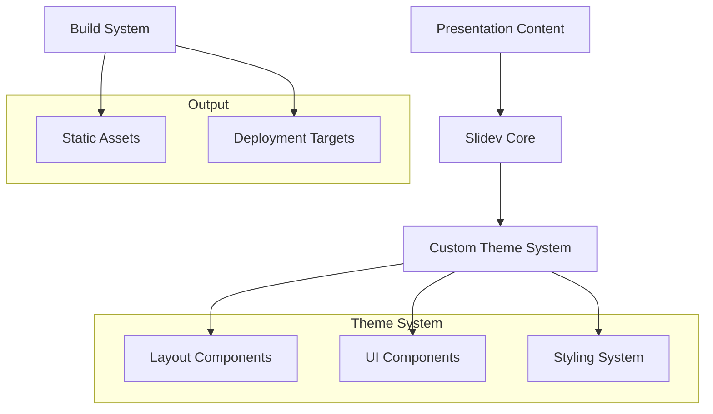

# Design Document

## Overview

The Cursor Slidev Kit polish initiative aims to transform the current presentation system into a professional, maintainable, and extensible platform. The design focuses on code quality improvements, enhanced visual design, better developer experience, and robust deployment processes while maintaining the existing YouWare branding and aesthetic.

## Architecture

### High-Level Architecture



### Component Architecture

The system follows a layered component architecture:

1. **Core Slidev Layer**: Base Slidev functionality and Vue 3 runtime
2. **Theme Layer**: Custom cursor theme with layouts and base components
3. **Application Layer**: Project-specific components and content
4. **Content Layer**: Markdown slides and assets

## Components and Interfaces

### Theme System Enhancement

#### Enhanced Theme Structure
```
slidev-theme-cursor/
├── components/           # Reusable UI components
│   ├── YouWareCard.vue  # Enhanced card component
│   ├── YouWareButton.vue # Button component
│   ├── CodeBlock.vue    # Syntax highlighted code
│   └── MediaEmbed.vue   # Media embedding component
├── layouts/             # Slide layout templates
│   ├── cover.vue        # Enhanced cover layout
│   ├── two-cols.vue     # Two column layout
│   ├── center.vue       # Centered content layout
│   └── full-image.vue   # Full image background layout
├── styles/              # Styling system
│   ├── index.ts         # Style entry point
│   ├── variables.css    # CSS custom properties
│   ├── typography.css   # Typography system
│   ├── components.css   # Component styles
│   └── animations.css   # Animation definitions
└── setup/               # Theme configuration
    ├── shiki.ts         # Code highlighting setup
    └── components.ts    # Global component registration
```

#### Component Interface Specifications

**YouWareCard Component**
```typescript
interface YouWareCardProps {
  hoverable?: boolean
  variant?: 'default' | 'elevated' | 'outlined'
  padding?: 'sm' | 'md' | 'lg'
  borderRadius?: 'sm' | 'md' | 'lg'
}
```

**GlowBackground Component**
```typescript
interface GlowBackgroundProps {
  intensity?: number
  colors?: string[]
  animationDuration?: number
  blur?: number
  opacity?: number
}
```

### Enhanced Component System

#### New Components to Implement

1. **CodeBlock Component**: Enhanced syntax highlighting with copy functionality
2. **MediaEmbed Component**: Responsive media embedding (YouTube, images, etc.)
3. **AnimatedCounter Component**: Improved counter with smooth animations
4. **ProgressIndicator Component**: Slide progress visualization
5. **NavigationDots Component**: Slide navigation indicators

#### Component Standards

- All components use Vue 3 Composition API with `<script setup>`
- TypeScript interfaces for all props and emits
- Comprehensive prop validation with defaults
- Scoped styling with CSS custom properties
- Accessibility attributes (ARIA labels, roles)
- Responsive design considerations

## Data Models

### Theme Configuration Model

```typescript
interface ThemeConfig {
  colors: {
    primary: string
    secondary: string
    accent: string
    background: string
    surface: string
    text: {
      primary: string
      secondary: string
      muted: string
    }
  }
  typography: {
    fontFamily: {
      primary: string
      secondary: string
      mono: string
    }
    fontSizes: Record<string, string>
    lineHeights: Record<string, number>
  }
  spacing: Record<string, string>
  borderRadius: Record<string, string>
  shadows: Record<string, string>
  animations: {
    duration: Record<string, string>
    easing: Record<string, string>
  }
}
```

### Component Props Models

```typescript
// Base component props
interface BaseComponentProps {
  class?: string
  style?: Record<string, string>
  id?: string
}

// Layout props
interface LayoutProps extends BaseComponentProps {
  background?: string
  padding?: string
  gap?: string
}

// Animation props
interface AnimationProps {
  duration?: number
  delay?: number
  easing?: string
  disabled?: boolean
}
```

## Error Handling

### Component Error Boundaries

Implement Vue error handling for graceful component failures:

```typescript
// Error handling composable
export function useErrorHandler() {
  const handleError = (error: Error, context: string) => {
    console.error(`[${context}] Component error:`, error)
    // Log to external service in production
  }
  
  return { handleError }
}
```

### Build Error Handling

- Comprehensive error messages for build failures
- Validation of theme configuration
- Asset loading error handling
- Deployment error recovery

### Runtime Error Handling

- Graceful degradation for missing assets
- Fallback components for failed renders
- User-friendly error messages
- Development vs production error handling

## Testing Strategy

### Unit Testing

**Component Testing**
- Vue Test Utils for component testing
- Props validation testing
- Event emission testing
- Slot content testing
- Accessibility testing

**Theme Testing**
- CSS custom property validation
- Layout responsiveness testing
- Color contrast validation
- Typography rendering testing

### Integration Testing

**Build Process Testing**
- Theme compilation testing
- Asset optimization validation
- Export functionality testing
- Multi-format output validation

**Deployment Testing**
- GitHub Pages deployment validation
- Vercel deployment testing
- Netlify deployment verification
- Cross-platform compatibility testing

### Visual Regression Testing

- Screenshot comparison testing
- Layout consistency validation
- Animation behavior verification
- Cross-browser rendering testing

### Performance Testing

- Bundle size optimization validation
- Loading performance testing
- Animation performance profiling
- Memory usage monitoring

## Implementation Phases

### Phase 1: Code Quality & Structure
- TypeScript migration for all components
- Component interface standardization
- File structure reorganization
- Linting and formatting setup

### Phase 2: Enhanced Components
- GlowBackground component enhancement
- New component implementations
- Animation system improvements
- Accessibility enhancements

### Phase 3: Theme System Polish
- CSS custom properties system
- Typography system enhancement
- Color system refinement
- Layout system improvements

### Phase 4: Developer Experience
- Documentation improvements
- Example enhancements
- Build process optimization
- Development tooling setup

### Phase 5: Deployment & Performance
- Deployment process optimization
- Performance improvements
- Asset optimization
- Cross-platform testing

## Design Decisions and Rationales

### Vue 3 Composition API
**Decision**: Use Composition API with `<script setup>` for all components
**Rationale**: Better TypeScript integration, improved code organization, and modern Vue.js best practices

### CSS Custom Properties
**Decision**: Implement comprehensive CSS custom property system
**Rationale**: Enables easy theming, better maintainability, and runtime customization

### Component-First Architecture
**Decision**: Build reusable components with clear interfaces
**Rationale**: Promotes code reuse, easier testing, and better maintainability

### TypeScript Integration
**Decision**: Full TypeScript adoption for component props and configuration
**Rationale**: Better developer experience, compile-time error catching, and improved code documentation

### Monospace Typography
**Decision**: Maintain Courier Prime as primary font family
**Rationale**: Aligns with YouWare branding and provides consistent character spacing for technical content

### Performance-First Animations
**Decision**: Use CSS animations with hardware acceleration
**Rationale**: Better performance, smoother animations, and reduced JavaScript overhead

This design provides a solid foundation for polishing the Cursor Slidev Kit while maintaining its current functionality and aesthetic appeal.