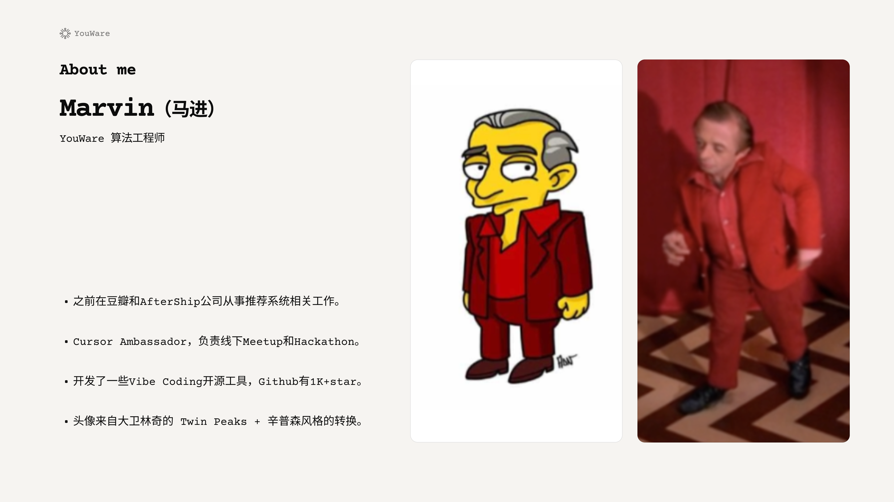
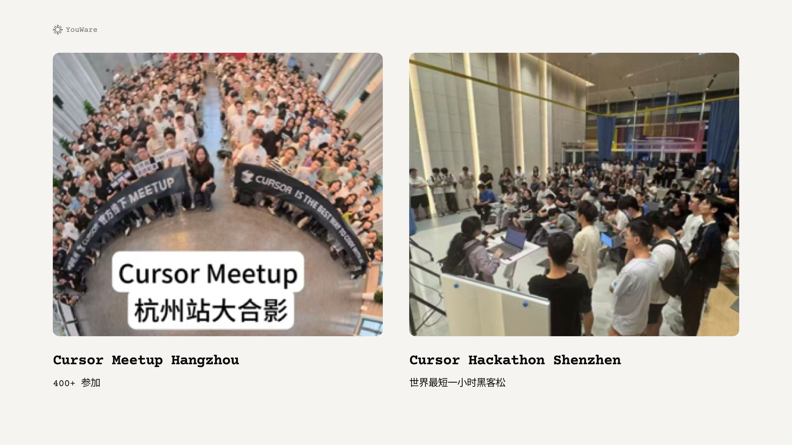
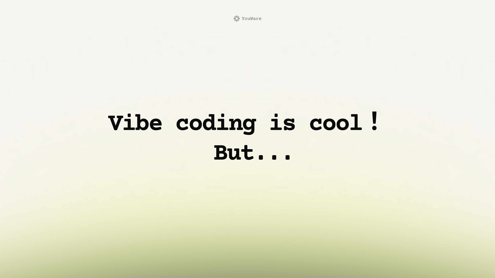
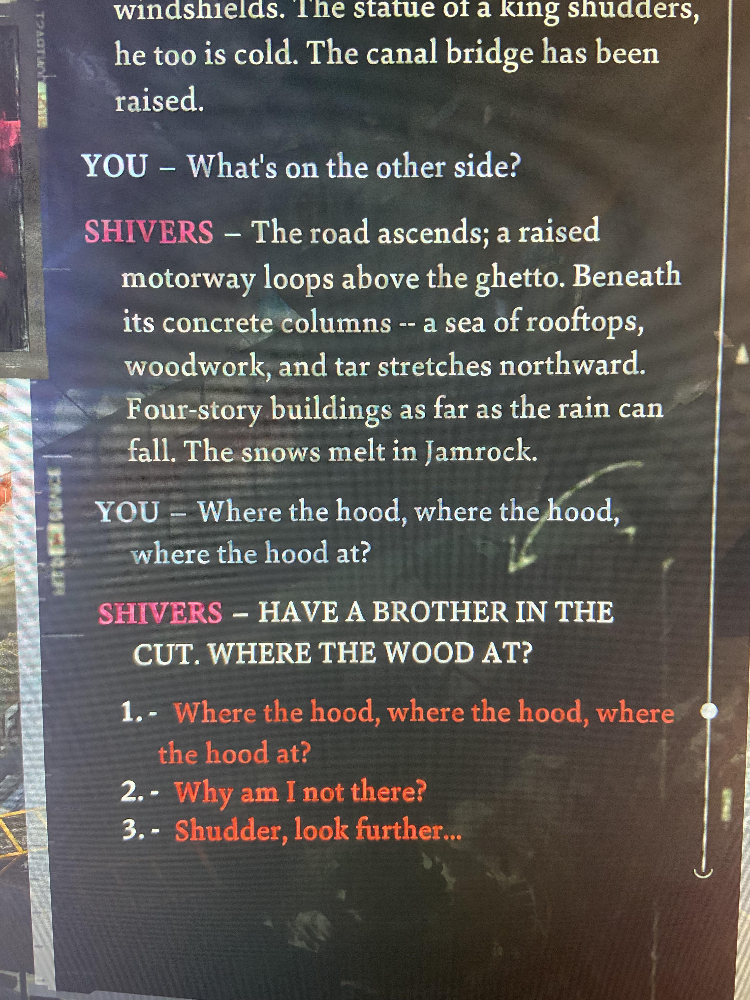
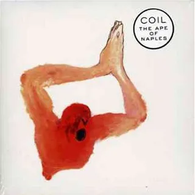
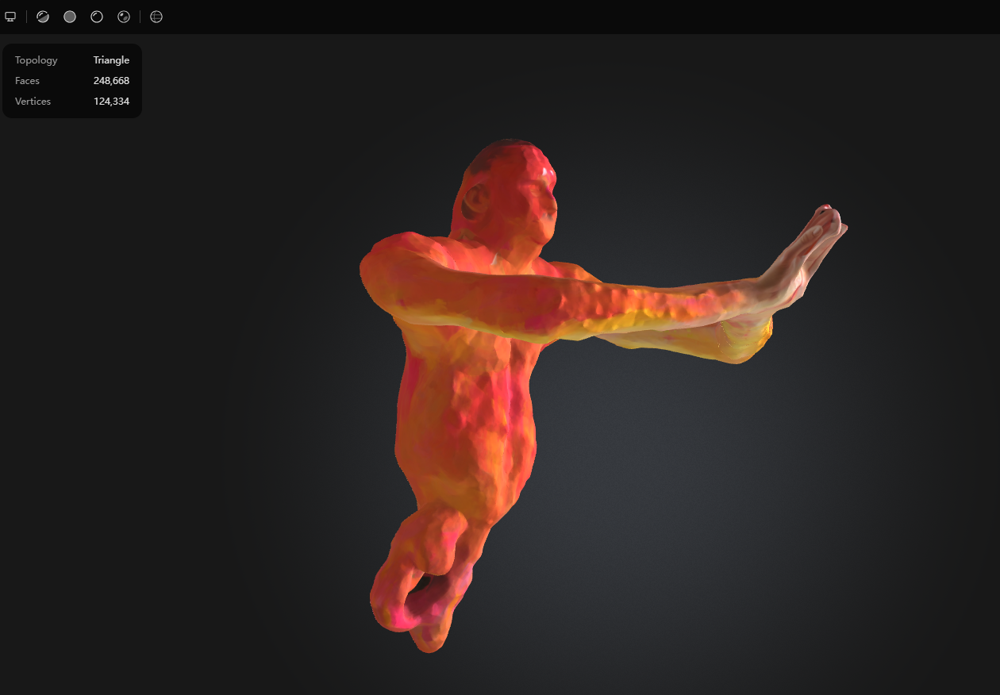
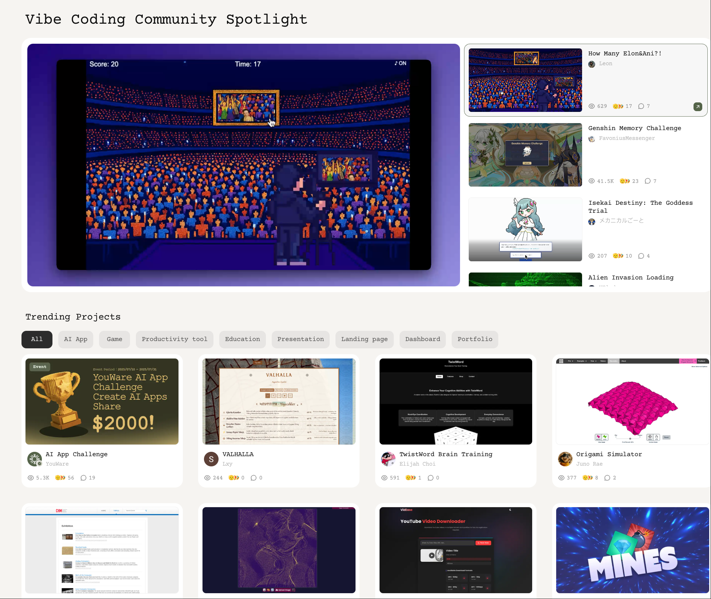
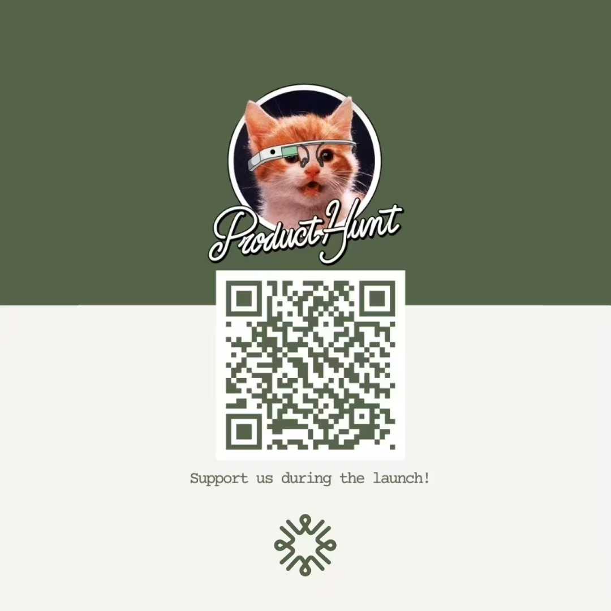

  

---
layout: cover
---

  

---
layout: cover
---

  

---
layout: default
---

# What's vibe coding, exactly?

  

    
  

  
  

    
  

  <h2 class="text-2xl font-medium mb-4">快速调查：Vibe coding 出来的代码是否应该 review？</h2>

---
layout: cover
---

  

---
layout: default
---

  <h2 class="text-2xl font-medium mb-8">为什么 Vibe Coding 最后都只在做 Landing Page?</h2>
  

    
  

---
layout: default
---

# What went wrong? 

  

    
  

  
  

    
    
  

---
layout: two-cols
---

# What is vibe?

  
  

    
Cursor Meetup Hangzhou

    
2025 年 7 月 12 日

    
硅星人主编 王兆洋

  

::right::

  
  
  

    <h2 class="text-3xl font-bold text-[#5A6650]">
      Vibe is all you need.
    </h2>
  

---
layout: default
---

  

    <Youtube id="8tK3IxZG80k" :width="1000" :height="640" />
  

  <h2 class="text-4xl font-medium mb-4">即使你有毕加索的技术，你就能画出毕加索的画吗？</h2>

---
layout: default
---

# Vibe coder and painter

  <!-- Left column - 1/3 width -->
  

    
  

  <!-- Right column - 2/3 width -->
  

    

      <h3 class="text-5xl font-medium mb-4" v-click="2">创作者的共同点</h3>
      <ul class="space-y-4 text-3xl text-[#333333]" v-click="3">
        <li>黑客与画家都是创作者。对于想写出漂亮程序的黑客来说，计算机只是一种工具，就像画家的画笔 —— Paul Graham</li>
        <li>Vibe Coding 让我们每个人都成为了神笔马良。</li>
      </ul>
    

    

      <h3 class="text-xl font-medium mb-4" v-click="4">真正的挑战</h3>
      <ul class="space-y-2 text-3xl text-[#333333]" v-click="5">
        <li> 如何管理色彩 (如何管理上下文)</li>
        <li> 补救还是重画 (硬聊还是重开)</li>
        <li> 内心的 Image (Vibe)</li>
      </ul>
    

  

---
layout: two-cols
---

# How to get vibes?

  <ul class="space-y-6 text-lg">
    <li v-click="1" class="text-4xl">不知道自己想要什么，这很正常</li>
    <li v-click="2" class="text-4xl">Good Artist Copy, Great Artist Steal</li>
    <li v-click="3" class="text-4xl">这句话其实是毕加索说的</li>
  </ul>

::right::

  

---
layout: default
---

# Case: My personal website

  

    

      <h3 class="text-3xl font-medium mb-4">背景</h3>
      
换工作比较闲，想做一下个人网站

    

    

      <h3 class="text-3xl font-medium mb-4">第一版<a href="https://aabdoo23.vercel.app/" class="text-[#5A6650] hover:underline">尝试</a></h3>
    

  

  

    

      
    

  

---
layout: default
---

# Inspiration

  

    <Youtube id="Ucct_YVl1tY" :width="800" :height="400" />
  

  

    
  

---
layout: default
---

# What if...

---
layout: default
---

# Creating my own OS

  

    
最初尝试：Mac System 7 风格
 
AI 很擅长，但觉得没有意思

  

  

    <h3 class="text-xl mb-6" v-click="3">灵感：Terry A. Davis TempleOS</h3>
    

      
      
    

  

  

    过去需要花一辈子的事情，现在只需要几分钟
  

---
layout: default
---

# Adding more elements
用 3D 大脑来组织项目？

  

    <Youtube id="Uss7_PGaFLQ" :width="1200" :height="700" />
  

---
layout: default
---

# I could create whatever I want

  

    

      
理念的转变：

      
你可以做你想到的一切

      
限制你的只有想象力

    

    

      
加入那些真正喜欢的元素：

      

        

          <h3 class="text-xl font-light">凌晨的海面，极光</h3>
        

        

          <h3 class="text-xl font-light">极乐迪斯科的对话框</h3>
        

        

          <h3 class="text-xl font-light">The Ape of Naples的封面</h3>
        

      

    

  

  

    
    

      
      
    

  

---
layout: default
---

# Toolkit

  <!-- Left: Tools Used -->
  

    <h3 class="text-6xl font-bold mb-8 text-[#1A1A1A]">🛠️ 我使用的工具</h3>
    <ul class="space-y-12">
      <li class="flex items-center gap-6">
        

        Cursor + Roo code + Claude code
      </li>
      <li class="flex items-center gap-6">
        

        除了联网搜索没有别的 MCP
      </li>
    </ul>
  

  <!-- Right: Overlooked Steps -->
  

    <h3 class="text-6xl font-bold mb-8 text-[#1A1A1A]">✨ 杀手锏</h3>
    <ul class="space-y-12">
      <li class="flex items-center gap-6">
        

        通过 Roo Code 进行 AI 头脑风暴
      </li>
      <li class="flex items-center gap-6">
        

        做选择题而不是写作文
      </li>
    </ul>
  

---
layout: default
---

# Thoughts

  

    

      

      强迫自己不去改代码，锻炼自己的 prompt 能力
    

  

  

    

      

      你可以不喜欢它，但你要了解它
    

  

  

    

      

      拥抱不确定性，随机是创意的源泉
    

  

  

    

      

      使用 code-based 方案，而不是 UI-based 方案 (e.g. SuperCollider vs Ableton)
    

  

  

    

      

      多看别人的项目，从中获得启发
    

  

---
layout: default
---

# Youware: Vibe coder's community

  <!-- Left: Text (1/3) -->
  

    

      大部分人都是先看见再相信
      所以要先让他们看见
    

  

  
  <!-- Right: Image (2/3) -->
  

    
  

---
layout: default
---

# Support us

  

