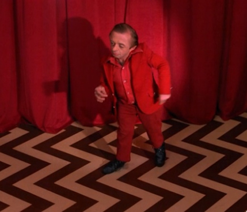

# Vibe is All You Need —— 从感觉到表达

  

---
layout: two-cols
---

# Self Introduction

## Marvin (马进)

<ul class="text-base space-y-2">
  <li>算法工程师 @YouWare，之前在豆瓣和 AfterShip 做推荐系统</li>
  <li>Cursor 的 Ambassador，线下 Meetup & Hackathon 的主办方</li>
  <li>做过一些 Vibe Coding 开源工具，Github 1k+ star</li>
  <li>头像来自于大卫林奇的 Twin Peaks + 辛普森风格迁移</li>
</ul>

::right::

  <YouWareCard :hoverable="true" class="w-55 h-55">
    
  </YouWareCard>
  
  <YouWareCard :hoverable="true" class="w-55 h-55">
    
  </YouWareCard>

---
layout: two-cols
---

# Cursor Meetup Hangzhou

  

::right::

# Cursor Hackathon Shenzhen

  

---
layout: default
---

# What's vibe coding, exactly?

  <YouWareCard :hoverable="true">
    
  </YouWareCard>
  
  <YouWareCard :hoverable="true">
    
  </YouWareCard>

  <h2 class="text-2xl font-medium mb-4">快速调查：Vibe coding 出来的代码是否应该 review？</h2>

---
layout: default
---

# Vibe coding is cool, but...

  
  

    
掌控了可控核聚变

    
却拿来给手机充电

  

  <h2 class="text-2xl font-medium mb-4">为什么大家 Vibe Coding 最后都只在做 Landing Page?</h2>

---
layout: default
---

# What went wrong? 

  

    
  

  
  

    
    
  

---
layout: two-cols
---

# What is vibe?

  <YouWareCard :hoverable="true" class="p-6">
    
    

      
Cursor Meetup Hangzhou

      
2025 年 7 月 12 日

      
硅星人主编 王兆洋

    

  </YouWareCard>

::right::

  
  
  

    <h2 class="text-3xl font-bold text-[#5A6650]">
      Vibe is all you need.
    </h2>
  

---
layout: default
---

# Vibe coder and painter

  

    <Youtube id="8tK3IxZG80k" width="500" height="360" />
  

  <h2 class="text-2xl font-medium mb-4">即使你有毕加索的技术，你就能画出毕加索的画吗？</h2>

---
layout: default
---

# Vibe coder and painter

  <!-- Left column - 1/3 width -->
  

    
  

  <!-- Right column - 2/3 width -->
  

    <YouWareCard class="p-6">
      <h3 class="text-xl font-medium mb-4">创作者的共同点</h3>
      <ul class="space-y-4 text-[#333333]">
        <li>黑客与画家都是创作者。对于想写出漂亮程序的黑客来说，计算机只是一种工具，就像画家的画笔 —— Paul Graham</li>
        <li>Vibe Coding 让我们每个人都成为了神笔马良。</li>
      </ul>
    </YouWareCard>
    <YouWareCard class="p-6">
      <h3 class="text-xl font-medium mb-4">真正的挑战</h3>
      <ul class="space-y-2 text-[#333333]">
        <li> 如何管理色彩 (如何管理上下文)</li>
        <li> 补救还是重画 (硬聊还是重开)</li>
        <li> 内心的 Image (Vibe)</li>
      </ul>
    </YouWareCard>
  

---
layout: two-cols
---

# How to get vibes?

  <ul class="space-y-6 text-lg">
    <li>不知道自己想要什么，这很正常</li>
    <li>Good Artist Copy, Great Artist Steal</li>
    <li>这句话其实是毕加索说的</li>
  </ul>

::right::

  

---
layout: default
---

# Case: My personal website

  

    <YouWareCard class="p-6">
      <h3 class="text-xl font-medium mb-4">背景</h3>
      
换工作阶段比较闲，想做一下个人网站

    </YouWareCard>
    <YouWareCard class="p-6">
      <h3 class="text-xl font-medium mb-4">第一版<a href="https://aabdoo23.vercel.app/" class="text-[#5A6650] hover:underline">尝试</a></h3>
    </YouWareCard>
  

  

    

      
    

  

---
layout: default
---

# What if...

  

    <Youtube id="Ucct_YVl1tY" width="500" height="320" />
  

  

    
  

---
layout: default
---

# What if...

---
layout: default
---

# Creating my own OS

最初尝试：Mac System 7 风格
AI 很擅长，但觉得没有意思

灵感：Terry A. Davis TempleOS

过去需要花一辈子的事情，现在只需要几分钟

---
layout: default
---

# Adding more elements

Psychonauts

---
layout: default
---

# I could create what I want

最重要的是这个理念的转变

Disco Elysium

Ape of Naples

Near Death Experience

---
layout: default
---

# I could create what I want

最重要的是这个理念的转变

Near Death Experience

Disco Elysium

Ape of Naples

---
layout: default
---

# My Toolkit

AI 头脑风暴模式

---
layout: default
---

# My Suggestions

1. 强迫自己不去改代码，锻炼自己的 prompt 能力
2. 使用 code-based 方案，而不是 UI-based 方案 (e.g. SuperCollider vs Ableton)
3. 多看别人的项目，从中获得启发

---
layout: default
---

# Youware: Vibe coder's community

---
layout: cover
---

# Thank You

  Ready to build something amazing?

  @youware
  youware.com

